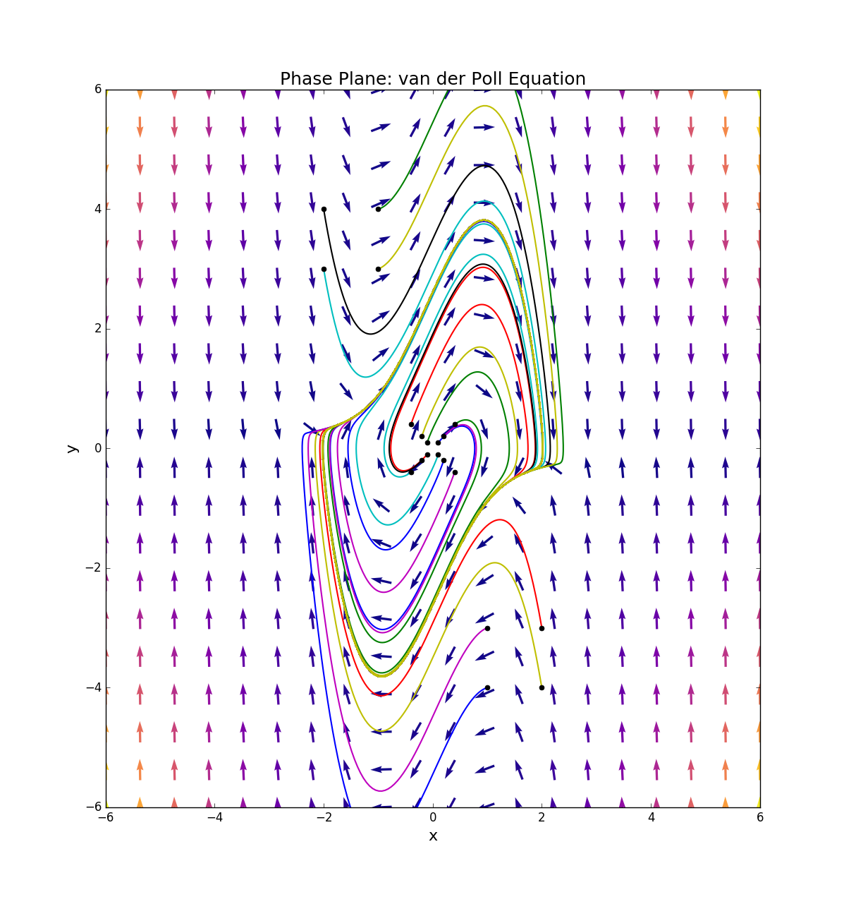

-------------------
dynamic-system-plot
-------------------

Functions for visualization and analysis of dynamic systems.

Features
--------

**Phase plane**: Python function for ploting vector field and solution curves in the phase plane
for planar autonomous systems.

